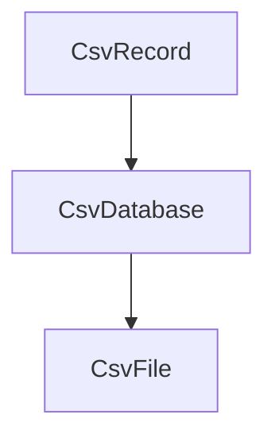

# CSV Helper

This module helps enabling integratin with ProjectHelper to update GitHub projects with data from a CSV file.

## Architecture

```mermaid
flowchart TD
CsvRecord --> CsvDatabase --> CsvFile

```
